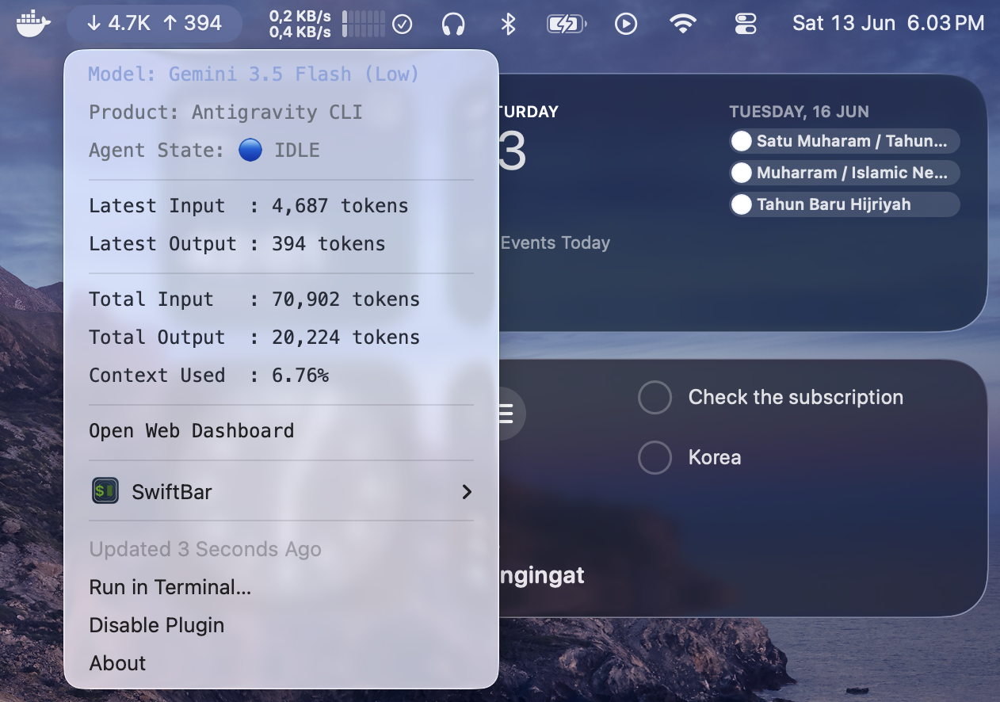

# 🪙 Boros Token

[](LICENSE)
[](docker-compose.yml)
[](dashboard_server.js)

**Boros Token** is a lightweight, real-time local dashboard designed to monitor token usage (input, output, cached tokens) across multiple AI CLI agents in one unified interface.



---

## ⚡ Features

- 📊 **Real-time Metrics**: View accumulated token consumption (Input, Output, Cache) and estimated costs.
- 📈 **Trend Graphs**: Interactive charts showing token usage trends over time via Chart.js.
- 📡 **Multi-Agent SSE Stream**: Live updates pushed instantly from Node.js server using Server-Sent Events.
- 🔄 **Auto-Polling**: Automatically parses SQLite logs of Codex and OpenCode locally.
- 🐳 **Docker Native**: Run seamlessly in containerized environments with a simple command.
- 🍏 **macOS Menu Bar Integration**: View current token usage directly from your menu bar using SwiftBar.

---

## 🍏 macOS Menu Bar Integration

You can monitor your agent token usage directly in your Mac's menu bar using [SwiftBar](https://github.com/swiftbar/SwiftBar).

1. Install **SwiftBar** via Homebrew:
   ```bash
   brew install --cask swiftbar
   ```
2. Make sure the SwiftBar script in this project is executable:
   ```bash
   chmod +x /path/to/boros-token/agy_swiftbar.py
   ```
3. Create a symlink of the script to your SwiftBar plugins folder, appending the refresh rate (e.g., `.5s` to refresh every 5 seconds):
   ```bash
   ln -s /path/to/boros-token/agy_swiftbar.py ~/Library/Application\ Support/SwiftBar/Plugins/agy_swiftbar.5s.py
   ```
4. SwiftBar will now display the latest token metrics (e.g., `BT Codex:1.2K/300`) directly in your menu bar. Clicking it exposes more details and a link to open the web dashboard.

---

## 🚀 Quick Start

### Option A: Using Docker (Recommended & Auto-runs on Login)

1. Make sure **Docker Desktop** is running.
2. Build and start the container:
   ```bash
   docker compose up -d --build
   ```
3. Open the dashboard:
   ```text
   http://localhost:4000
   ```

> [!TIP]
> **Auto-run on Boot**: In Docker Desktop Settings under the **General** tab, check **"Start Docker Desktop when you log in"**. Because the container is configured with `restart: unless-stopped`, the dashboard will automatically run whenever your Mac starts.

---

### Option B: Local Setup (Native)

1. Start the server using the helper script:
   ```bash
   ./boros-restart.sh
   ```
2. Open your browser:
   ```text
   http://localhost:4000
   ```

---

## 🔌 Integrating Agents (Wiring)

Each agent sends a JSON payload to `stdin` of its respective sender script.

### Wiring CLI Hooks:
```bash
# Feed JSON payloads into sender script
cat payload.json | python3 codex_sender.py
cat payload.json | python3 opencode_sender.py
cat payload.json | python3 agy_sender.py
```

### Convenient Shell Aliases:
Add the following to your `~/.zshrc` or `~/.bash_profile`:
```bash
alias codex-token='python3 /path/to/boros-token/codex_sender.py'
alias opencode-token='python3 /path/to/boros-token/opencode_sender.py'
alias agy-token='python3 /path/to/boros-token/agy_sender.py'
```

---

## 📋 Payload Format

The dashboard accepts JSON payloads sent via POST to `/api/metadata` matching this schema:

```json
{
  "agent": "codex",
  "source": "codex",
  "session_id": "abc-123",
  "conversation_id": "abc-123",
  "product": "codex",
  "cwd": "/path/project",
  "model": {
    "id": "gpt-4.1",
    "display_name": "GPT-4.1"
  },
  "agent_state": "working",
  "context_window": {
    "total_input_tokens": 1200,
    "total_output_tokens": 300,
    "used_percentage": 1.4,
    "current_usage": {
      "input_tokens": 400,
      "output_tokens": 120,
      "cache_read_input_tokens": 50
    }
  }
}
```

---

## 📄 License

Distributed under the MIT License. See [LICENSE](LICENSE) for more information.
